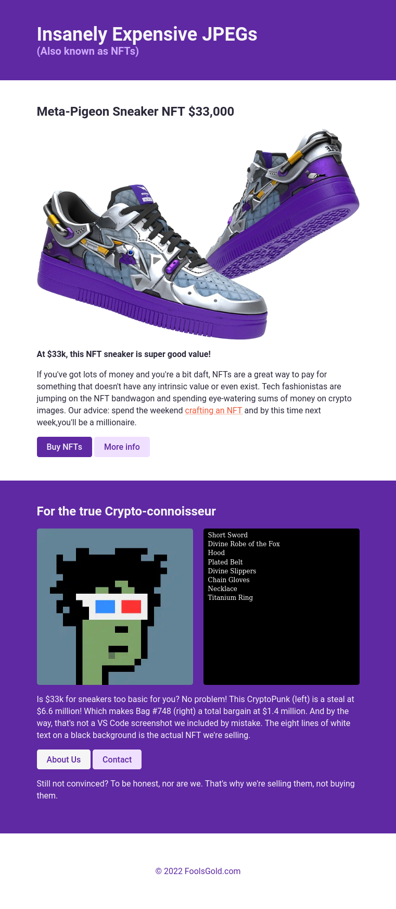

# NFT Site
Learned some advanced CSS and HTML concepts and how to refactor codes.

## Lessons Learned:
- Semantic HTML
- Hover and active states using pseudo selectors
- Specificity
- Compound selectors (and when to avoid them)
- Inline-block
- Multiple classes on one element

