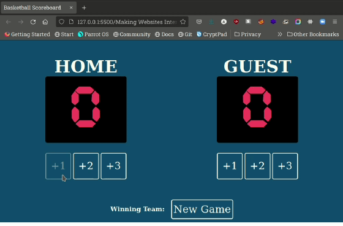

# Basketball Scoreboard

A Solo projects that combined some the skills learned from previous lessons to create an Interactive Basketball Scoreboard.

## Skills used:
* HTML 
* Intermediate CSS Styling
* CSS Flex-box
* Javascript
* DOM

